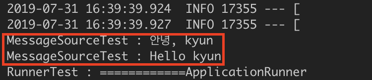

# 스프링 프레임워크 핵심기술 2 - ApplicationContext의 다양한 기능\(1\)

이번에 공부 내용 스프링 프레임워크의 기본이자 핵심인 `ApplicationContext`입니다. **`ApplicationContext`는 스프링 컨테이너의 한 종류로 스프링 프레임워크의 핵심**입니다.

### 스프링 컨테이너란?

여기서 잠깐 컨테이너에 대해 이야기를 하자면, **컨테이너는 보통 인스턴스들의 라이프 사이클을 관리하며, 생성된 인스턴스들에게 기능을 제공**하는 것입니다.  즉, **컨테이너에 적절한 설정만 있다면 프로그래머의 개입없이도 작성한 코드를 스스로 참조한 뒤 자신이 알아서 객체의 생성과 소멸을 관리**합니다.

Servlet 컨테이너가 Servlet의 생성, 초기화, 서비스 실행, 소멸 등에 관한 모든 권한을 가지고 있는 것 처럼,    **스프링 컨테이너는  종속객체 주입을 이용하여 애플리케이션을 구성하는 여러 Bean\(이하 빈\)들을 관리하고 애플리케이션의 서비스 실행 등을 관리** 합니다. 

자 그러면 다시 `ApplicationContext`로 넘어오도록 하죠, `ApplicationContext`는 또 다른 스프링 컨테이너인`BeanFactory`와 비교를 합니다.   
하지만 실질적으로 `ApplicationContext`는 `BeanFactory`를 구현하고 있어 `BeanFactory`의 확장된 버전이라고 생각하면 좋습니다. 그렇다면 `ApplicationContext`는 또 어떤 기능들이 있을까요?


### ApplicationContext의 다양한 기능 1 - Environment

실제로 스프링 프레임워크에서 제공하는 `ApplicationContext` 인터페이스를 보면 아래와 같습니다.

```java
public interface ApplicationContext extends EnvironmentCapable, ListableBeanFactory, HierarchicalBeanFactory,
		MessageSource, ApplicationEventPublisher, ResourcePatternResolver {		
		...
}
```

2종의 BeanFactory 와 나머지 추가 기능들인 **`EnvironmentCapable`, `MessageSource`, `ApplicationEventPublisher`, `ResourcePatternResolver(ResourceLoader)`** 입니다.

이 추가 기능들중 먼저 EnvironmentCapable을 소개하겠습니다. EnvironmetCapable으로 보면 아래와 같은 코드를 가지고 있죠. 아주 간단하죠? getEnvironment 메소드를 통해 Environment 객체를 가져올 수 있습니다.

```java
public interface EnvironmentCapable {
	/**
	 * Return the {@link Environment} associated with this component.
	 */
	Environment getEnvironment();
}
```

그럼 Environment는 어떤 객체일 까요? Environment는 크게 2가지 역할을 합니다.

**첫 번째로 Profile\(이하 프로파일\) 활성화 및 설정** 입니다.  `@Profile` 어노테이션에 profile value를 주어 빈에 등록하게 되면 해당 value로 빈들이 묶이게 됩니다. 이렇게 빈들의 묶음인 프로파일들 중에 어떤 프로파일을 활성화할 것인지 `Environment` 에서 선택할 수 있죠. 

```java
@Component
public class ProfileTestRunner implements ApplicationRunner {
    @Autowired
    ConfigurableApplicationContext ctx;       

    @Override
    public void run(ApplicationArguments args) throws Exception {
        ConfigurableEnvironment environment = ctx.getEnvironment();
        environment.setActiveProfiles("dev");       
        System.out.println(Arrays.toString(environment.getActiveProfiles()));
}
```

아쉽게도 `ApplicationContext`에서 `geEnvironment()` 메소드를 통해 얻은 `Environment` 객체의 경우 `setActiveProfile()` 메소드가 없어 활성화할 프로파일을 선택할 수 없지만 \(getActiveProfile은 존재\) **`SpringApplication`에서 기본적으로 사용하는 `ConfigurableApplicationContext` \(가장 많이 사용하는 ApplicationContext\)에서 `getEnvironment()`를 통해 가져온 `ConfigEnvironment`객체의 경우 `setActiveProfile()` 통해 프로파일은 활성화**할 수 있습니다.

**두 번째 Environment의 역할은  Property\(이하 프로퍼티\) 소스 설정 및 프로퍼티 값을 가져오는 것**입니다. 즉, 애플리케이션에 등록되는 key-value 쌍의 프로퍼티들을 접근할 수 있도록 해줍니다. 

프로퍼티들은 SpringBoot에서 제공하는 `application.properties`이 될 수 도 있고, 운영체제나 JVM에서 넘겨 받는 프로퍼티들이 될 수 도있습니다. 또는 `springApplication`에 `@PropertySource`를 통해 새로운 프로퍼티들을 등록할 수 도 있죠. 이런 프로퍼티들을 `Environment`의 `getProperty()` 메소드를 통해 가져올 수 있습니다.


### ApplicationContext의 다양한 기능 2 - MessageSource

다음은 `ApplicationContext`의 두번쨰 기능인 `MessageSource` 입니다. Spring의 `MessageSource`는 메세지에 대한 국제화\(i18n\)을 제공하는 인터페이스입니다.   
i18n은 internationalization\(국제화\)의 약칭으 소프트웨어가 언어에 종속적이지 않고  한국어든 영어든 동시에 입력해서 사용할 수 있어야 합니다.    
**`MessageSource`는 메세지 설정 파일을 모아서 각 국가마다 로컬라이징을 함으로써 각 지역에 맞춤 메세지를 제공**할 수 있죠.

Spring에서 메세지 설정 파일을 위해서는 properties 확장자가 붙은 프로퍼티 파일을 사용해야 합니다. 정확히는 다음과 같이 **\[파일이름\]\_\[언어\]\_\[국가\].properties** 형식으로 파일을 만들어야 합니다. 

        **기본 메세지의 경우  : message.properites \(시스템의 언어 및 지역에 맞는 프로퍼티 파일이 존재하지 않을 경우\)**   
        **한글\_한국 메세지 :     message\_ko\_KR.properties**   
        **영어\_미국 메세지 :     message\_en\_US.properties**

위와 같이 설정파일을 만들어 줬다면 그 안에 key-value 형식으로 키 값과 메세지 내용을 입력하여 사용할 수 있습니다.

```c
#message_ko_KR.proerties
greeting =안녕, {0}

#message_en_US.properties
greeting =Hello {0}
```

이렇게 설정 파일을 통해 입력된 값을 MessageSource에서 getMessage\(\) 메소드를 통해 얻을 수 있습니다.  
**첫 번째 인자로 설정파일에서 등록한 key값을 주고 다음 인자로 설정 파일에서 등록한 메세지 내용 다음에 추가적으로  적을 수 있습니다. 세 번째 인자로 이제 지역을 선택하여 다양한 message.properties 중에 어떤 프로퍼티를 사용할지 고를 수 있죠.**  아래의 소스와 출력 결과를 보면 정상적으로 출력된 것을 확인할 수 있습니다.

```java
@Component
public class MessageSourceTest implements ApplicationRunner {

    @Autowired
    MessageSource messageSource;

    @Override
    public void run(ApplicationArguments args) throws Exception {
            System.out.println("MessageSourceTest : "+messageSource.getMessage("greeting", new String[] { "kyun" }, Locale.KOREA));
            System.out.println("MessageSourceTest : "+messageSource.getMessage("greeting", new String[] { "kyun" }, Locale.US));
    }
}
```




### 마치며

이렇게 ApplicationContext의 기능들 중 Environment와 MessageSource를 알아봤습니다. 나머지 기능ApplicationEventPublisher와 ResourceLoader에 대해서는 다음 포스팅에서 찾아뵙겠습니다. 

